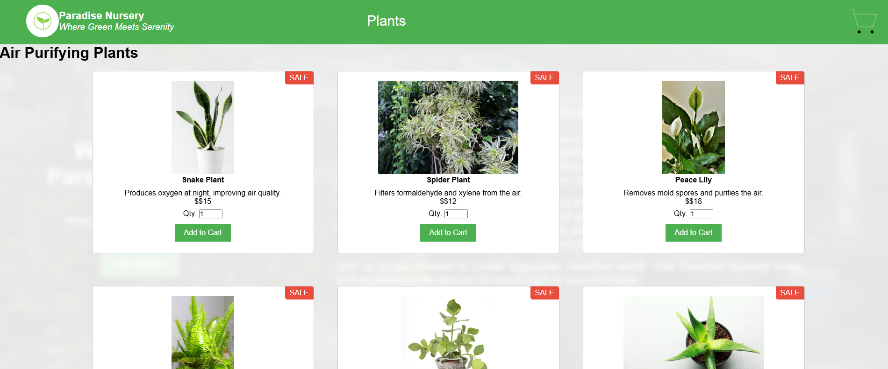
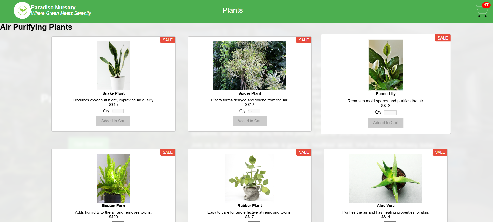
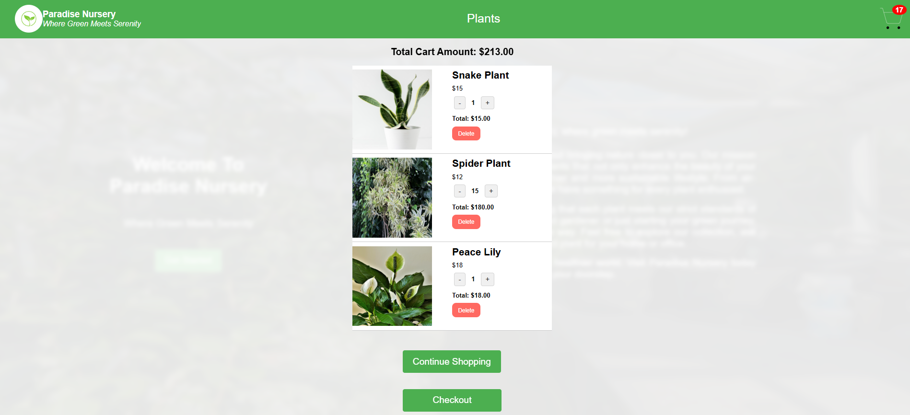
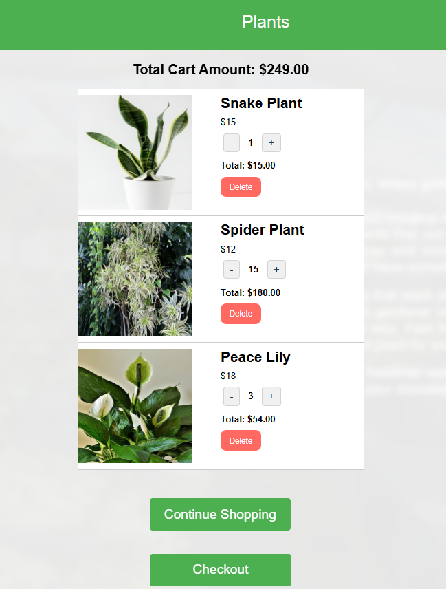

# Paradise Nursery Shopping Application

Link : https://husseinalsaleh.github.io/e-plantShopping/

The _Paradise Nursery_ shopping cart features include:

- A Landing page with a button linking to the product listing page
- A navigation bar with links to the landing, product listing, and shopping cart pages
- A card for each plant that showcases the different plants along with their images, name, description, cost and an **Add to cart** button.
- A two sections describing the plants in that section. For example, "Aromatic Plants" and "Medicinal Plants".
- A cart page which displays the products in the cart.
- The cart has a card for each type of plant in the cart. Each card has the thumbnail, the unit cost, the cost for all of the plants of that type and buttons to increase and decrease the quantity along with **Delete** button.
- A **Continue Shopping** and **Checkout** buttons

